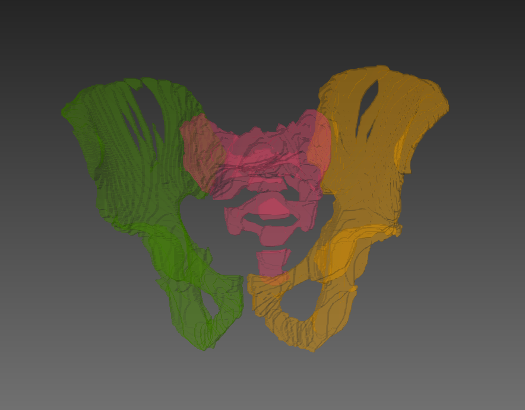
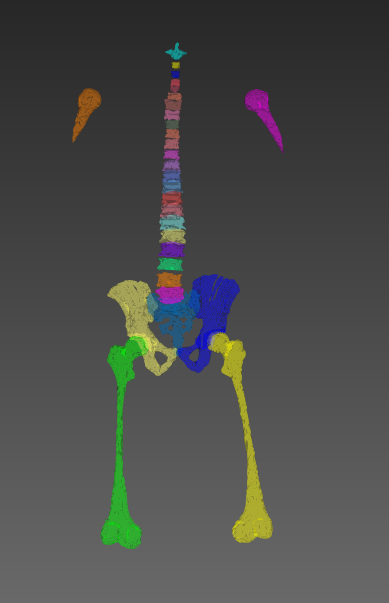

# AVID

Copyright © German Cancer Research Center (DKFZ), Division of Medical Image Computing (MIC). Please make sure that your usage of this code is in compliance with the code license.

## Description
<span style="color:red">
TODO
</span>

AVID is a python framework for the **data-driven processing** of huge amounts of data.

It provides a series of actions that can be used to process the data, including `resampling`, `registration`, `radiomics feature calculation` or `python-based actions`. These 
are just examples, a more detailed list can be found [below](#available-actions). 

AVID enables to select, link, sort, and split the data by user defines criteria, e.g. `case_id` and `timepoint`.

## Example

In the following, an example use-case will be roughly described. This is a special project and may help new users. You can also skip this and start with our example scripts instead.

In the context of multiple myeloma (a type of bone cancer) image analysis, bone marrow compartments are automatically processed by a computational pipeline. The algorithms were 
developed for three bone marrow compartments in the pelvis (see Figure 1). The three different bone marrow compartments are shown in three different colors.



Figure 1: Segmentation of bone marrow compartments in the pelvis.


In the next step, the segmentation was extended to whole-body, segmenting a total of 30 bone marrow compartments (see Figure 2). Again, each bone marrow compartment is shown in 
a different color.




Figure 2: Segmentation of 30 bone marrow compartments.

<span style="color:red">
TODO
</span>

An MRI scan can now contain an arbitrary number of those segmentations, depending on its field of view. This means, that for a particular MRI scan, there can be any number of 
segmentations present, depending on what body bart is captured by the scan.

For the pipeline, it is essential to process each image with
all available corresponding segmentations.
AVID allows to select all MRI images and all segmentations and link them according to use-case-specific criteria. In the example, we want to link images and segmentations according to their `case_id` and `timepoint`. The following code snippet exemplifies how to do this.

```
from avid.selectors import ActionTagSelector as ATS
from avid.actions.pythonAction import PythonNaryBatchActionV2

import my_processing_function

image_selector = ATS('MRI')
mask_selector = ATS('Seg')

# ...

with session:
   PythonNaryBatchActionV2(primaryInputSelector=image_selector,
                           primaryAlias='mr_images',
                           additionalInputSelectors ={'mask': mask_selector},
                           # Link images according to Case and TimePoint
                           linker={'additional': CaseLinker(allowOnlyFullLinkage=False)+TimePointLinker(allowOnlyFullLinkage=False)},
                           # Split images and masks according to the case
                           splitter={'mr_images': CaseSplitter(), 'mask': CaseSplitter()},
                           actionTag="Example_Action", 
                           generateCallable=my_processing_function, 
                           passOnlyURLs=True).do()
```

More detailed examples on how to use AVID selectors, linkers and splitters can be found in the example jupyter notebook.

## Quick start

### Installation

#### Python requirements
You must use python 3.x

Add Python directory and python/scripts to your Windows PATH as otherwise, neither python, nor avidconfig will be found!

#### Install via pip
The simpelest way to install AVID is via PyPi. Simply use the following command to install AVID and all its dependencies:

<span style="color:red">
TODO: This is a temporary link! See: T28581 
</span>

```
pip install --index-url https://test.pypi.org/simple/ avid2
```

#### Install via the repository

A detailed description on how to install AVID from the repository, can be found [here](manual_installation.md).


### Configuration

AVID itself is a python framework for the data-driven processing. It provides a variety of [actions](#actions) to do so. Many of these actions use external tools wich need to be 
configured in order for avid to find and access them.

#### Configure your AVID tools path
To configure AVID to find the needed tools, use
```
avidconfig settings avid.toolspath <your_desired_tools_path>
```
Please have in mind that python/scripts has to be in PATH!

## Get the tools (for the AVID actions)
_Is this still up to date?_

<span style="color:grey">
REMARK: This tools feature is currently only supported for Windows systems.
For Linux and MacOS you have to build the tools directly on your machine.
You have two choices:
1. "install" the tools. This means that you will get copies to the tools, but
   it is not connected to any versioning of the version control system the tools
   are stored in.
2. "update" the tools. This will make an svn checkout/update on the central tool
   repository. This is interesting for developers or if you will often update the avid source
   and you want to have an easy possibility to update the tools accordingly.
3. "add" the tools. This will allow to register tools "by hand". This is interesting for
   tools that are currently not centrally stored or are local developments.
</span>

###install all tools specified by your AVID distribution
requirement is an installed SVN (accessible via commandline, e.g. https://tortoisesvn.net.
Be sure to enable command line support in installation) and Visual Studio 2013
redistributable installer for x64 (https://www.microsoft.com/de-de/download/details.aspx?id=40784)

use
```
  avidconfig tools install
```

###update all tools specified by your AVID distribution
use
```
  avidconfig tools update
```

###install or update specific tools
use
```
  avidconfig tools install <toolname1> [<toolname2> [...]]
```
or
```
  avidconfig tools update <toolname1> [<toolname2> [...]]
```

###add own/specific tools
use
```
  avidconfig tools add <toolname/actionID> <path to executable>
```
This will registere a new tool with the given toolname/actionID and let the configuration point to the also specified
executable.


## Actions
### Available actions
TODO

## ARTEFACTS

## SELECTORS

## LINKERS

## SPLITTERS

## SORTERS

# FAQs

